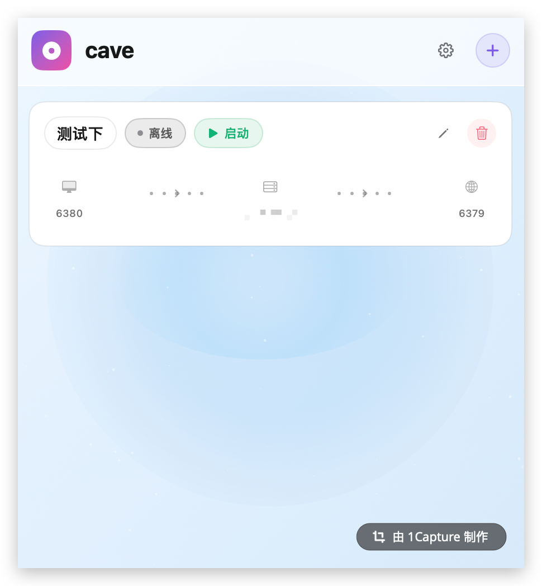
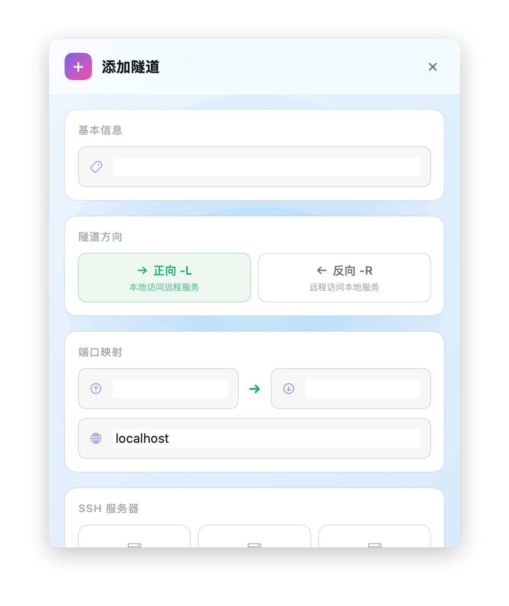
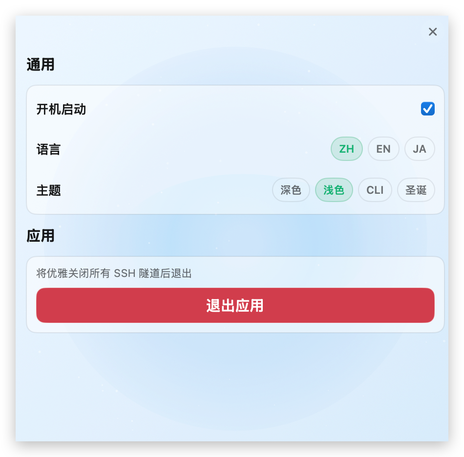

# cave

SSH トンネルを管理する macOS メニューバーアプリ。

**Languages:** [中文](README.md) | [English](README.en.md) | [日本語](README.ja.md)

## 主な機能

- メニューバー常駐：SSH トンネルの迅速な管理（フォワード `-L` / リバース `-R`）
- トンネルリスト：ワンクリックで開始/停止、編集、削除、ステータス可視化
- ノードチェーン：ローカル / プロキシ / ターゲットが一目で分かり、クリックでコピー可能
- 国際化：`ZH / EN / JA` をサポート、デフォルトは中国語
- テーマ：`Dark / Light / CLI / Christmas`
- 設定センター：起動時の自動起動、言語、テーマ、グレースフル終了（トンネルを先に閉じる）

## 機能デモ

### メインインターフェース


### トンネル追加


### 設定センター


## 環境要件

- macOS 13+
- Xcode Command Line Tools（`swift` を含む）

## ローカルビルドと実行

### デバッグビルド

```bash
swift build
```

### `.app` パッケージ化

```bash
./build.sh
open build/cave.app
```
